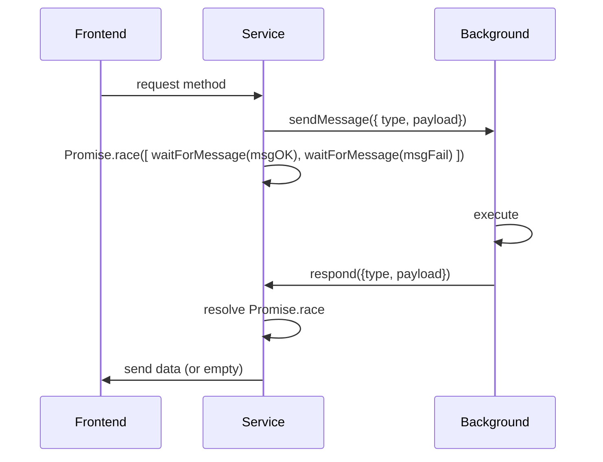
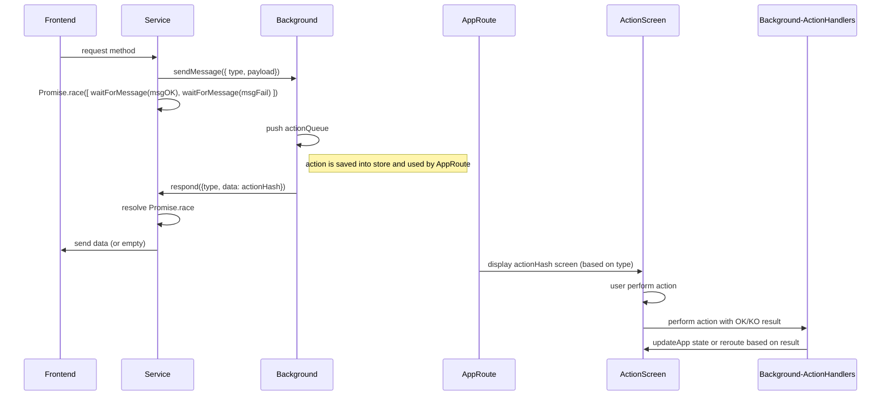

# Messaging

Direct communication from frontend and background service is not allowed and it's done through `messages`.

The React component will call a function defined into a `service` first (located in `/src/ui/services`)

```js
const Component = () => {
useEffect(() => {
	serviceFunction(argument)
}, [])

const onClick = () => {
	serviceFunction2(argument)
}

return <button onClick={onClick} />
}
```

The service called will then send the messages to communicate with the background service with the use of `sendMessage`.

The service will then need to wait for the response (that's another message) using `waitForMessage`.

```js
const serviceFunction = async () => {
    sendMessage({type: "A_MESSAGE", data: { param: "param"}})
    try {
    await Promise.race([
      waitForMessage("A_MESSAGE_RES"), // background OK response
      waitForMessage("A_MESSAGE_REJ").then(() => { // background FAILURE response
        throw new Error("Rejected")
      }),
    ])
  } catch {
    throw Error("Could not declare contract")
  }
}
```

These messages will be then managed by messaging handlers. When a new handler is added, in order to be handled, it need to be added to the `messageStream` in `/src/background/index.ts`

When the service send a message, the handler will will check the `type` of the message and, if there is a match, it will execute the related code.

- Handlers are located in `/src/background/aMessaging.ts`.
- Message types: `/src/shared/messages`
- Action queue types `/src/shared/actionQueue`

```js
export const handleAMessaging: HandleMessage<AMessage> = async ({
  msg,
  background,
  respond,
}) => {
  const { actionQueue, wallet } = background
  const { type } = msg

  switch (type) {
    case "A_MESSAGE": {
      const { data } = msg
      const { address, networkId, classHash, contract } = data
      await wallet.selectAccount({ address, networkId })

        /* This is not mandatory, depends if an action is needed */
      const action = await actionQueue.push({
        type: "ACTION_TYPE",
        payload: {},
      })

      try {
        await doSomething()
      } catch {
        return respond({
        type: "A_MESSAGE_REJ",
        data: {
          actionHash: action.meta.hash,
        },
      })
      }

      return respond({
        type: "A_MESSAGE_RES",
        data: {
          actionHash: action.meta.hash,
        },
      })
    }
  }

  throw new UnhandledMessage()
}
```

Actions messages are handled in the same way and defined in `/src/background/actionHandlers.ts`.

Action message types are defined into `/src/shared/actionQueue/types.ts`

### messaging flows

Basic messaging flow



action queue types `/src/shared/actionQueue`

With action queue flow


