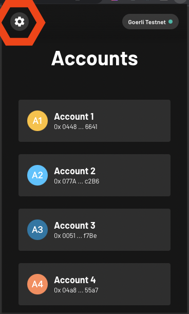
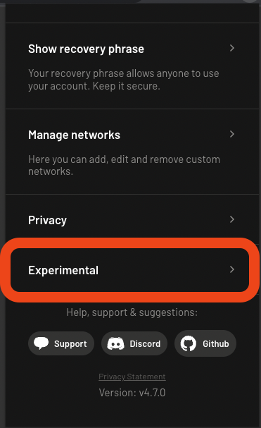
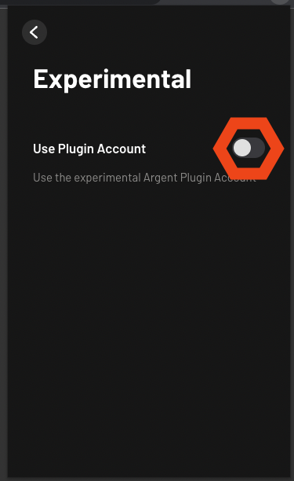
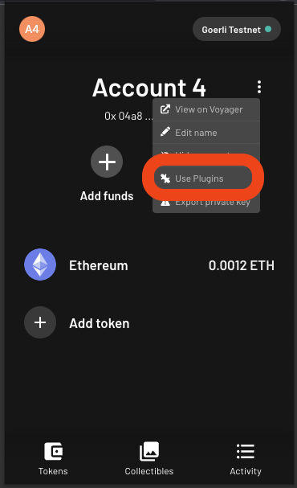
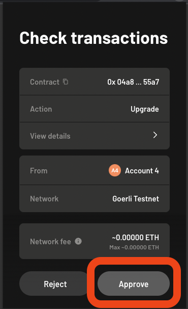
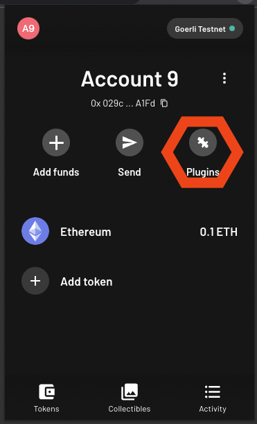
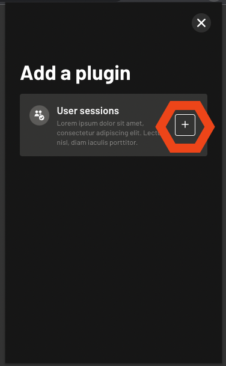

# Sessions

Sessions can be used to send transactions from a dapp on behalf of a user without requiring their confirmation with a wallet.

The user is guaranteed that the dapp can only execute transactions that comply to the policies of the session and until the session expires.

## Installation

```bash
npm install @argent/x-sessions
# or
pnpm add @argent/x-sessions
# or
pnpm add @argent/x-sessions
```

## Creating a session as a dapp

First you need to have a deployed account with a valid Signer. This is the account that will authorise the session and interact with the contracts of your dapp.

A session kind of looks like this:

```typescript
interface Policy {
  contractAddress: string
  selector: string
}

interface RequestSession {
  key: string
  expires: number
  policies: Policy[]
}
```

You can either get that by using the Account and Signer classes provided by starknet.js, or use an injected instance by a wallet.

```typescript
const account = window.starknet.account
```

Next you need to come up with the permissions you would like for your session. You also need to generate the session keypair you want to grant these rights to.

This example session will allow the dapp to execute an example endpoint on an example contract without asking the user to approve the transaction again. After signing the session the dapp can execute all transactions listed in `policies` whenever it wants and as many times as it wants.

```typescript
import { Signer, ec } from "starknet"

// gets signer with random private key you need to store if you want to reuse the session
const sessionSigner = new Signer()

const requestSession: RequestSession = {
  key: await sessionSigner.getPublicKey(),
  expires: Math.floor((Date.now() + 1000 * 60 * 60 * 24) / 1000), // 1 day in seconds
  policies: [
    {
      contractAddress: "0x...",
      selector: "doAction"
    }
  ]
}
```

Now you can sign the session with the account you have. Depending on how your account works, the user may get asked to sign a message

```typescript
import { createSession } from "@argent/x-sessions"

// calls account.signMessage internally
const signedSession = await createSession(requestSession, account)
```

### Using established sessions

With your signed session you can now use it with your dapp to do transactions without the user having to approve again.

```typescript
import { SessionAccount } from "@argent/x-sessions"

const sessionAccount = new SessionAccount(
  account,
  account.address,
  sessionSigner,
  signedSession
)

// this transaction should get executed without the user having to approve again
const tx = sessionAccount.execute({
  // lets assume this is a erc20 contract
  contractAddress: "0x...",
  selector: "transfer",
  calldata: [
    "0x..."
    // ...
  ]
})
```

You can also use the session when you dont have access to the main account (`window.starknet.account`). You only need access to the `signedSession` object and the `sessionSigner`.

```typescript
const sessionAccount = new SessionAccount(
  providerWithCorrectNetwork,
  "0xaccountAddress",
  sessionSigner,
  signedSession
)
```

Congratulations, you can now use your dapp to execute transactions without the user having to approve!

## Allowing a session as a user

> Note: Sessions are an alpha feature and are not yet available on mainnet. You can use them on testnet, but expect bugs. That is also the reason why it is so inconvenient to activate them for use in Argent X right now.

Sessions can just be used with a new type of account, pioneered by Argent X. This guide will set you up with a new account that can use sessions, by deploying a Plugin Account and registering your first plugin (Sessions Plugin!).

### Activate Plugin account in Argent X

You can activate session accounts in Argent X Settings, under the "Experimental features" tab.

|  |  |  |
| --- | --- | --- |

### Deploy a Plugin Account

We strongly recommend to use a new account for sessions. You can create a new account in Argent X by clicking the big `+` button in the account list.

### Upgrade Account to use Plugin Account Implementation

You can upgrade your account to use the Plugin Account implementation by opening the account context menu and selecting "Use Plugins". It will prompt you to confirm a upgrade transaction.

|  |  |
| --- | --- |

### Register Sessions Plugin

After the upgrade is done you can register the Sessions Plugin by clicking the new Plugins button in your Account. It will prompt you to confirm a register transaction.

|  |  |
| --- | --- |

### Test if Sessions work

To test if sessions work for your account you can head to the [Wallet Playground](https://argentlabs.github.io/argent-x/). It should show `supports sessions: true` at the top and you should be able to test sessions in the playground.

Each "Use Session" click will send a transaction to mint 666 Test Tokens to the account.
